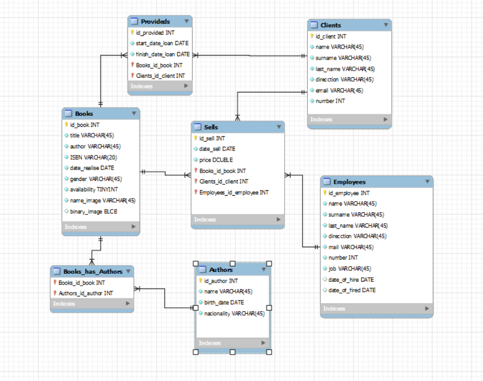

# 07_09_ASSI_intermediate_SQL

 ## Table of contents
 * [**Introduction**](#introduction)
 * [**Relational diagram**](#relational-diagram)
 * [**Data definition**](#data-definition)
   * [**Integrity constraint**](#integrity-constraint)
   * [**Referential integrity**](#referential-integrity)
   * [**Cascading actions in referential integrity**](#cascading-actions-in-referential-integrity)
   * [**Date, time or timestamp data types**](#date,-time-or-timestamp-data-types)
   * [**Binary large objects**](#Binary-large-objects)
   * [**Domains**](#domains)
   * [**Indexes**](#indexes)
   * [**Users**](#users)
   * [**Privileges**](#privileges)
   * [**Roles**](#roles)

 ## Introduction
 
In this task in pairs done by Samuel Piedra 🙋 & Fran González, we have to create a database using intermediate sql querys, it is a task in which we have to try to put all the knowledge acquired during the present course and also try to apply in our database script the following data.

```
Integrity constraints
Referential integrity
Cascading actions in referential integrity
Date, time or timestamp data types
Binary large objects
Domains
Indexes
Users
Privileges
Roles
```

## Relational diagram



1. In the table **Books** we have a many-to-many relationship with the table **Authors**,this relationship make another table named **Books_has_Authors** because a book can be written by several authors and an author can write several books. **Books** have a relationship one-to-many with **Sells** because since a book can be sold several times but a sale can only correspond to one book, for the last relation of **Books** is with Provideds one-to-many,since a book can be borrowed several times but a loan can only correspond to one book.
2. For the table **Clients** we have one relationship one-to-many with **Sells**, one client can make more than one buy, but one sold corresponds to one client,and have another one, one-to-many with **Provideds**,since a client can borrow several books but a loan can only be made by one client.
3. The table **Employees** would have one relationship one-to-many with the table **Sells**, as one employee can make several sales but one sale can only be made by one employee.


## Scripts
### ddl.sql
 This file contains the script to generate the database in postgres and the type of data to be inserted.

 _Example_:

 - Create the database and check if the database is unique.
```
SELECT 'CREATE DATABASE [db_name]' WHERE NOT EXISTS (SELECT FROM pg_database WHERE datname = '[db_name]')\gexec 
```
## Data definition
In this section we will explain how the data is constructed and defined to make its functionality clear and we also model the data to use the keywords mentioned in the introduction.
### Integrity constraint
Integrity constraints guard against accidental damage to the database, by ensuring that authorized changes to the database do not result in a loss of data consistency.

_Example 1_:

The following script is to generate a table using a 'CHECK' integrity constraint to determine the category of books.
```
CREATE TABLE IF NOT EXISTS Books (
  id_book SERIAL PRIMARY KEY,
  title VARCHAR(45) NOT NULL,
  author VARCHAR(45) NOT NULL,
  category VARCHAR(45) NOT NULL CHECK (category IN ('drama', 'classic', 'history', 'children', 'didactic')),
  ISBN VARCHAR(20) NOT NULL,
  date_release DATE NOT NULL,
  genre VARCHAR(45) NOT NULL,
  availability BOOLEAN NOT NULL,
  id_image INT,
  name_image VARCHAR(50),
  binary_image BYTEA
  ```
  _Example 2_:
  
In this example we are using the 'UNIQUE' constraint, every time you insert a new row, it checks if the value is already in the table. It rejects the change and issues an error if the value already exists. The same process is carried out for updating existing data.
  
  ```
  CREATE TABLE IF NOT EXISTS Clients (
    id_client SERIAL PRIMARY KEY,
    name client_data,
    surname client_data,
    last_name client_data,
    direction VARCHAR(45),
    email VARCHAR(45) UNIQUE,
    phone_number INT NOT NULL,
    CONSTRAINT id_client_UNIQUE UNIQUE (id_client)
) WITH (oids = false);
```

### Referential integrity
Ensures that a value that appears in one relation for a given set of attributes also appears for a certain set of attributes in another relation.

_Example_:

The following code is a script that references three tables such as books, clients and employees, these tables share functionality.
The tables books, clients or employees are in the sells table as FK and uses the id column as a reference so the books_id_book, clients_id_client and employees_id_employee we will write must be in both tables.

```
CREATE TABLE IF NOT EXISTS Sells (
id_sell SERIAL PRIMARY KEY,
date_sell DATE NOT NULL,
price NUMERIC(10, 2) NOT NULL,
books_id_book INT NOT NULL,
clients_id_client DEFAULT NULL,
employees_id_employee INT NOT NULL,
CONSTRAINT fk_Sells_Books1 FOREIGN KEY (books_id_book)
REFERENCES Books (id_book)
ON DELETE CASCADE
ON UPDATE CASCADE,
CONSTRAINT fk_Sells_Clients1 FOREIGN KEY (clients_id_client)
REFERENCES Clients (id_client)
ON DELETE CASCADE
ON UPDATE CASCADE,
CONSTRAINT fk_Sells_Employees1 FOREIGN KEY (employees_id_employee)
REFERENCES Employees (id_employee)
ON DELETE CASCADE
ON UPDATE CASCADE
);
````

### Cascading actions in referential integrity

_Example 1_:

**DELETE CASCADE**: When we create a foreign key using this option, it deletes the referencing rows in the child table when the referenced row is deleted in the parent table which has a primary key.

In our case our changes are reflected in the table "Books_has_authors" if we delete/update any value inside it, it affects the previous table.e.g;

```
//Start transaction
BEGIN;
// Savepoint created
SAVEPOINT undo;
// Delete some data
DELETE FROM books WHERE id_book = 1;
// Check the changes
SELECT * FROM books_has_authors;
// Results
 books_id_book | authors_id_author
---------------+-------------------
             2 |                 2
             3 |                 3
             4 |                 4
             5 |                 5
             6 |                 6
             7 |                 7
             8 |                 8
             9 |                 9
(8 rows)

// Use savapoint if it's necessary
ROLLBACK TO undo;
// Undone changes
SELECT * FROM books_has_authors;
// Results
 books_id_book | authors_id_author
---------------+-------------------
             1 |                 1
             2 |                 2
             3 |                 3
             4 |                 4
             5 |                 5
             6 |                 6
             7 |                 7
             8 |                 8
             9 |                 9
(9 rows)

// End transaction
COMMIT;
```
_Example 2_:

**UPDATE CASCADE**: When we create a foreign key using UPDATE CASCADE the referencing rows are updated in the child table when the referenced row is updated in the parent table which has a primary key.

 ### Date, time or timestamp data types
 
 Date in SQL is the principal data type to the columns related with dates, the structure is YYYY-MM-DD (Year-Month-Day), although it has more types, and with the time its the same, hh:mm:ss (Hours:Minutes:Seconds).
 
 _Example_:
 
 In this code we have 2 data types **DATE**, in this table we insert the start_date_loan and the finish_date_loan, the finish date cant be smaller than the starter date, for this we use a **CHECK**, checks that the start date is bigger than the finish date.
 
 ````
 CREATE TABLE IF NOT EXISTS Provideds (
id_provided SERIAL PRIMARY KEY,
start_date_loan DATE NOT NULL,
finish_date_loan DATE NOT NULL,
books_id_book INT NOT NULL,
clients_id_client INT NOT NULL,
CONSTRAINT fk_Provideds_Books1 FOREIGN KEY (books_id_book)
REFERENCES Books (id_book)
ON DELETE CASCADE
ON UPDATE CASCADE,
CONSTRAINT fk_Provideds_Clients1 FOREIGN KEY (clients_id_client)
REFERENCES Clients (id_client)
ON DELETE CASCADE
ON UPDATE CASCADE,
CONSTRAINT start_finish_dates_check CHECK (start_date_loan < finish_date_loan)
);
 ````


 
 
 


